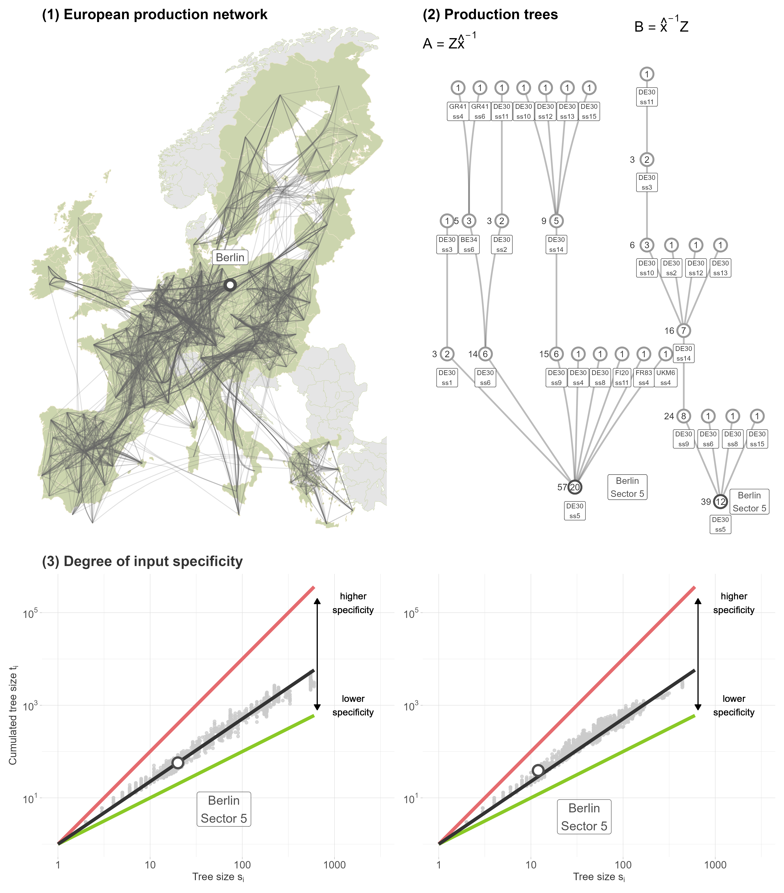

Each figure links to the research post it comes from.

::: {.grid}

::: {.g-col-12 .g-col-md-6 .gallery-card}
[](posts/phd-overview/index.qmd)

[**Sustainable regional development - A complexity economics analysis**<br>
 How to address sustainability transformation research with complexity economics? ](posts/phd-overview/index.qmd){.gallery-caption}
::: 

::: {.g-col-12 .g-col-md-6 .gallery-card}
[](posts/regional-synchronisation/index.qmd)

[**Synchronisation of regional development**<br>
 Do we need to adjust our understanding of regional development? ](posts/regional-synchronisation/index.qmd){.gallery-caption}
:::

::: {.g-col-12 .g-col-md-6 .gallery-card}
[](posts/llm-systematic-review/index.qmd)

[**LLM-assisted systematic review**<br>
A four-stage LLM pipeline that screens, classifies and extracts structured
model features from 62 publications.](posts/llm-systematic-review/index.qmd){.gallery-caption}
:::

::: {.g-col-12 .g-col-md-6 .gallery-card}
[](posts/production-networks-labor-share/index.qmd)

[**Production networks and the labor share**<br>
How to turn complex networkd data into labor's bargaining power insights.](posts/production-networks-labor-share/index.qmd){.gallery-caption}
:::

::: {.g-col-12 .g-col-md-6 .gallery-card}
[](posts/wellbeing-ml/index.qmd)

[**Predicting regional well-being with interpretable ML**<br>
Random forests + ALE plots reveal non-linear drivers of subjective
well-being across 388 OECD regions.](posts/wellbeing-ml/index.qmd){.gallery-caption}
:::


:::

```{=html}
<style>
.gallery-card {
  text-align: center;
  margin-bottom: 1.5rem;
}
.gallery-card img {
  width: 100%;
  height: 500px;              /* uniform card height          */
  object-fit: contain;        /* no cropping of figures       */
  background: #fff;
  border: 1px solid #e0e0e0;
  border-radius: 6px;
  padding: 0.5rem;
  transition: transform .15s ease, box-shadow .15s ease;
}
.gallery-card a:hover img {
  transform: scale(1.02);
  box-shadow: 0 4px 14px rgba(0,0,0,.12);
}
.gallery-caption {
  display: block;
  margin-top: .5rem;
  font-size: .9rem;
  color: inherit;
  text-decoration: none;
}
.gallery-caption:hover {
  text-decoration: underline;
}
</style>
```
