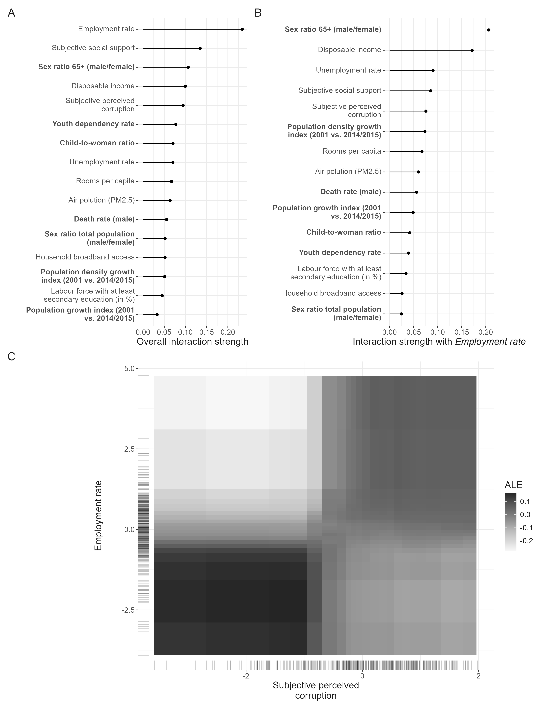

<!--Include academic icons or bottons-->



## Abstract

Subjective Well-Being (SWB) has emerged as a key measure in assessing societal progress beyond traditional economic indicators like GDP. While SWB is shaped by diverse socio-economic factors, most quantitative studies use limited variables and overlook non-linearities and interactions. We address these gaps by applying random forests to predict regional SWB averages across 388 OECD regions using 2016 data.
Our model identifies 16 key predictors of regional SWB, revealing significant non-linearities and interactions among variables. Notably, the sex ratio among the elderly, a factor underexplored in existing literature, emerges as a predictor comparable in importance to average disposable income. Interestingly, regions with below-average employment and elderly sex ratios show higher SWB than average, but this trend reverses at higher levels. This study highlights the potential of machine learning to explore complex socio-economic systems, connecting data-driven insights with theory-building. By incorporating multidimensionality and non-linear interactions, our approach offers a robust framework for analyzing SWB and informing policy design.

## Links

Published [paper](https://doi.org/10.1007/s11205-025-03643-5)

Available [data & code](https://zenodo.org/records/15535818) 
