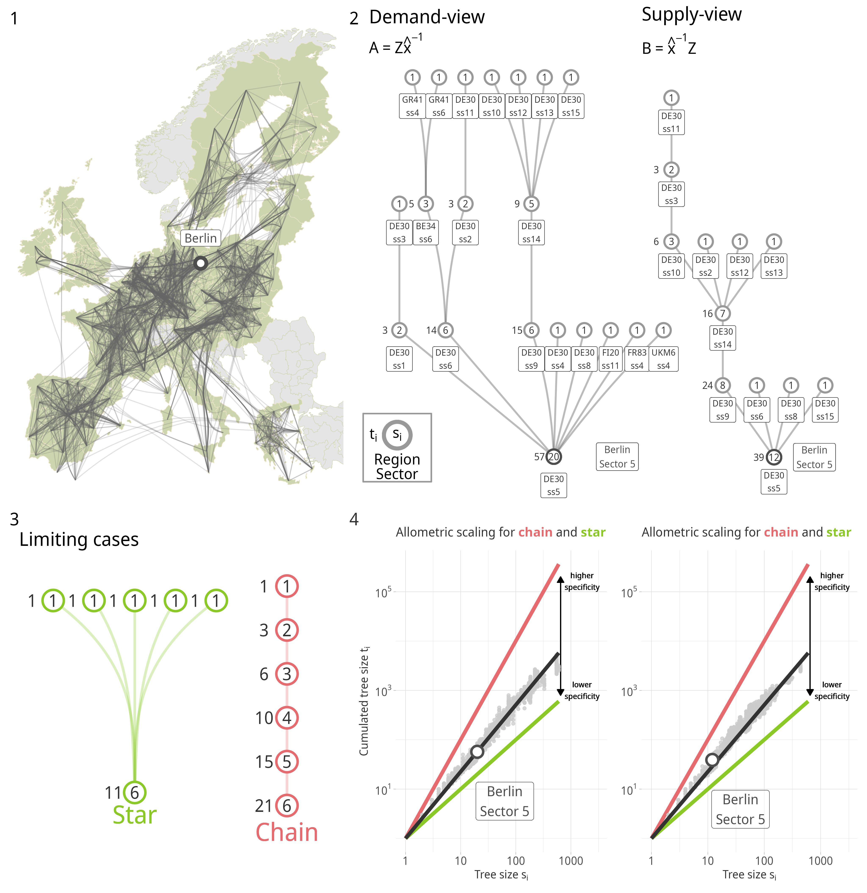

<!--Include academic icons or bottons-->



## Abstract

This article examines how input relationships in fragmented production systems shape functional income inequality. We argue that input specificity — reflecting the degree of specialization in intermediate goods production — affects workers' bargaining power and, consequently, the labor share through skill premia and the disruptive potential of strikes. Using regional input-output data for European economies and a novel methodology for constructing sectoral production trees, we measure input specificity and analyze its impact on the functional income distribution. Our results suggest significant regional and sectoral differences in input specificity and reveal a robust positive association between input specificity and labor share, offering new insights into regional economic inequality.

## Links

A preprint is available at [SRRN](https://papers.ssrn.com/sol3/papers.cfm?abstract_id=5349214)

Available [data & code](https://zenodo.org/records/14134659) 
