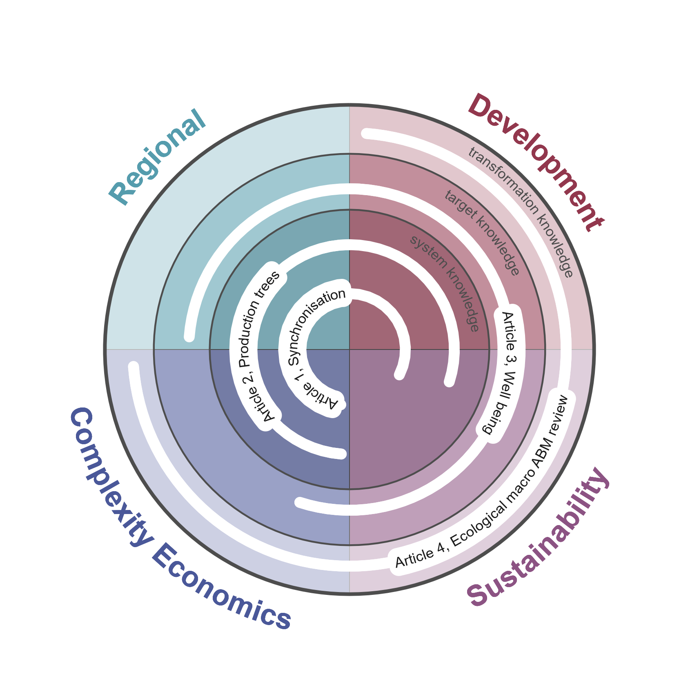

<!--Include academic icons or bottons-->



## Abstract

The modern world is a complex, interconnected system where traditional mono-causal explanations often fall short. This thesis explores how complexity economics can contribute to understanding and guiding sustainability transformations, focusing on the interconnected nature of social, economic, and ecological systems. The 21st-century sustainability crisis, characterized by breached planetary boundaries and persistent inequalities, underscores the urgency of adopting a complexity-based perspective.

The thesis is structured around three knowledge spheres of sustainability transformation research: system, target, and transformation knowledge. It employs complexity economics as a conceptual and methodological lens, treating the economy as a complex adaptive system. The research addresses regional development and inequality, income distribution, subjective well-being, and the modelling of post-growth policies using agent-based models.

Articles 1 and 2 examine how production networks structure regional outcomes, highlighting the role of interregional connections and input specificity in shaping development trajectories and wage shares. Article 3 uses machine learning to explore the multidimensional nature of subjective well-being, demonstrating the importance of complex interactions among regional factors. Article 4 systematically reviews ecological macroeconomic agent-based models using large language models, assessing their capacity to represent post-growth policies and identifying areas for future development.

Collectively, these studies show that complexity economics provides original insights across all three sustainability knowledge spheres, emphasizing the centrality of interdependencies in understanding the economy as a complex system. The thesis opens promising avenues for future research at the intersection of regional development, well-being, and complexity economics, and underscores the need for modelling and empirical approaches that capture the interactions and interdependencies characteristic of socio-economic systems.

