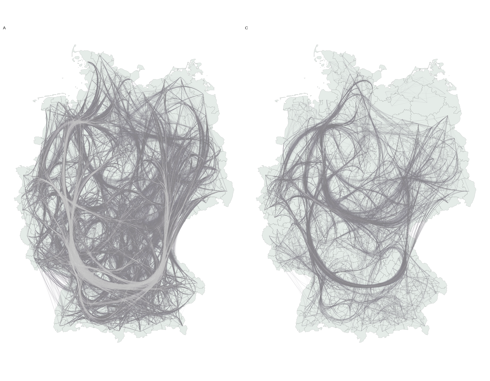

<!--Include academic icons or bottons-->



## Abstract

This study examines the impact of production network clusters (PNCs), derived through network science methods, on German counties’ economic development using a complex systems approach, conceptualising trade as information flows that guide economic agents’ decisions. Employing spatial econometrics, it finds that PNC trade flows predict regional economic synchronisation, though effects are not always positive. While results indicate that PNCs synchronise agents’ decisions within the same cluster, they may desynchronise their decisions with agents in spatially linked areas. These findings contribute to advancing a complexity economics framework for understanding regional development dynamics and disparities in Germany.

## Links

Published [paper](https://www.tandfonline.com/doi/full/10.1080/17421772.2025.2532609)

Available [data & code](https://zenodo.org/records/15547542) 
