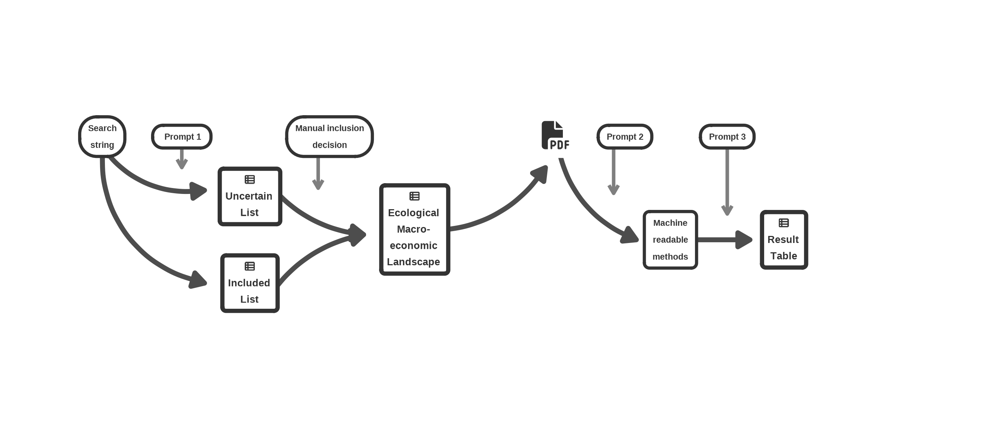
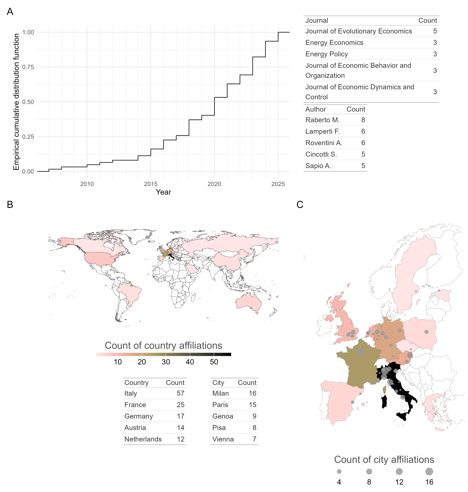
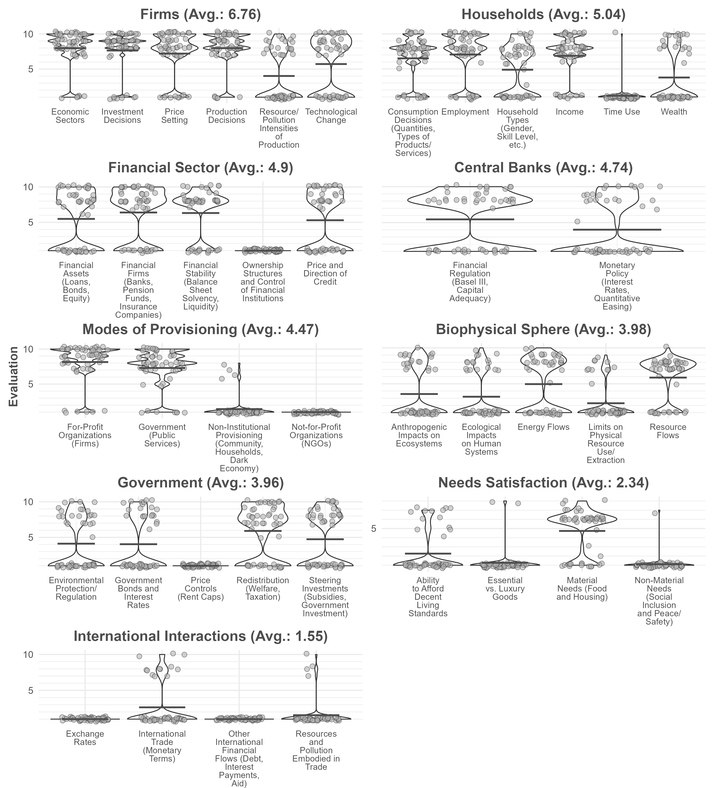

<!--Include academic icons or bottons-->



## What I built

A four-stage, human-in-the-loop LLM pipeline (R + Python) that turns a raw
literature search into a structured, machine-readable database of model
features — replacing the manual coding of ~40 features across 60+ full
papers (≈2,500 data points) that a classical systematic review would require.

1. **Retrieval & screening** — Scopus API query (`rscopus`); an LLM scores
   each abstract's relevance (1–10, temperature 0, single-number output);
   borderline scores are routed to manual review before inclusion.
2. **Full-text processing** — PDF text extraction with PyMuPDF (Python via
   `reticulate`), cleaning, and chunking into 1,000-word segments.
3. **Chunk classification** — an LLM rates every chunk (1–5) on whether it
   actually *describes* the model rather than merely mentioning it; only
   method-dense chunks pass on, cutting noise and token cost.
4. **Structured extraction** — an LLM extracts 41 predefined model elements
   per paper as validated JSON (presence score, supporting excerpt, section
   reference), parsed into tidy data frames for analysis and visualization.

**Tech stack:** R (tidyverse, httr2, reticulate) · Python (PyMuPDF) ·
open-weight LLMs (Llama 3.1, Mistral Large, GPT-OSS-120B) served via the
GWDG Academic Cloud's OpenAI-compatible API · deterministic settings
(temperature 0), automated retries, timeouts and rate limiting, response
validation, and human review at defined checkpoints. Fully scripted end to
end for reproducibility.

## Abstract

The intertwined crises of climate change, biodiversity loss, and unmet social needs have intensified calls to shift economic priorities from growth to well-being within planetary boundaries. Post-growth scholarship has developed a range of transformative policy proposals, but quantitative modeling of such structural changes remains limited. This study provides the first systematic review of ecological macroeconomic agent-based models (ABMs) and their capacity to represent post-growth scenarios. We identify 62 publications forming this emerging landscape, which is growing rapidly but remains heavily concentrated in Europe, particularly Italy. Using a novel workflow that leverages large language models (LLMs) for automated text analysis, we assess the presence of post-growth-relevant model elements. Our findings reveal uneven coverage: while traditional actors such as firms, households, and the financial sector are well represented, critical elements for post-growth analysis—including not-for-profit organizations, non-institutional provisioning, time use, international interactions, and needs satisfaction—are largely absent. Although some elements show increasing uptake, others remain persistently underrepresented. We conclude that ecological macroeconomic ABMs are not yet fully equipped to model post-growth transformations. Strengthening this modeling landscape requires both extending existing models with underrepresented elements and introducing entirely new thematic groups. Beyond the substantive contributions, our automated review workflow demonstrates how LLMs can streamline systematic reviews in fast-moving fields, offering a scalable and adaptable monitoring tool.

## Large Language Model Workflow

In this paper, we automate most of the labour intensive steps from a typical systematic literature review using LLMs:

1) inclusion/exclusion of the literature received from the SCOPUS search string, based on scanning the abstracts,
2) marking each part of each article's text if it describes the model,
3) scanning the marked texts and rate the inclusion of a wide range of post-growth model elements.

We employ the [API offered by GWDG](https://gwdg.de/services/application-services/ai-services/) for using different LLMs. 

## Results

We find a fast evolving, geographically concentrated modelling landscape that spans a wide range of academic journals, shown in @fig-overview.

{#fig-overview}

We receive scores on a wide variety of post-growth model elements from an LLM. Results are shown in @fig-results.

{#fig-results}

